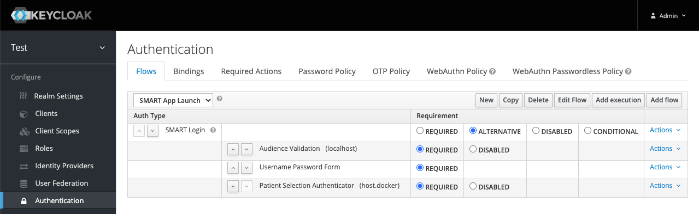
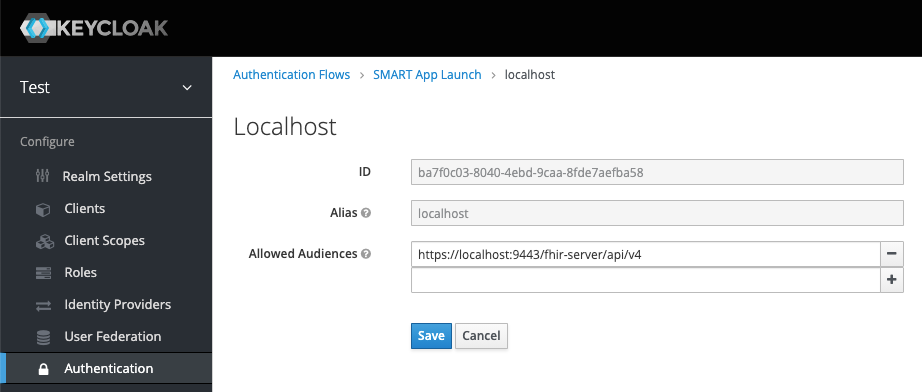
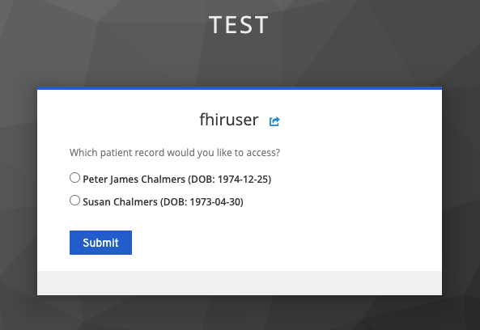
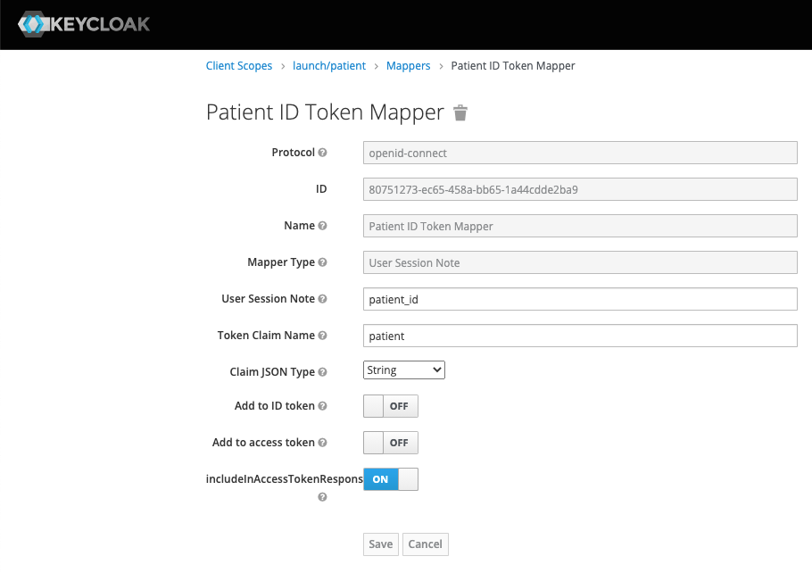

# Keycloak extensions for FHIR
The purpose of this project is to document and extend Keycloak in support of SMART on FHIR and related use cases.

[Keycloak](https://www.keycloak.org) is an open source identity and access management solution.

[HL7 FHIR](https://www.hl7.org/fhir) is a specification for sharing health-related data across processes, jurisdictions, and contexts.

[SMART on FHIR](https://docs.smarthealthit.org) is a collection of specifications that focus on authentication and authorization on top of HL7 FHIR.

## Background
Keycloak is configurable and extensible.
Users can automate the creation of SMART *scopes* by either manually creating them in the admin console, by scripting, or by calling the REST APIs.
However, supporting SMART *launch context* is a bit more tricky.

In particular, SMART App Launch extends the OAuth 2.0 / OpenID Connect token *response payload* with a set of [launch context parameters](http://www.hl7.org/fhir/smart-app-launch/scopes-and-launch-context/index.html#launch-context-arrives-with-your-access_token). For example, in the case of the `patient` context, a SMART-enabled client application would expect a `patient` parameter in the token response payload (alongside the access token).

In addition, SMART App Launch defines a custom `aud` parameter that clients must pass on their [authorization](http://www.hl7.org/fhir/smart-app-launch/#step-1-app-asks-for-authorization) request (in addition to the fields required by OAuth 2.0 / OpenID Connect). Per the SMART "best practices" document at http://docs.smarthealthit.org/authorization/best-practices/#25-access-token-phishing-by-counterfeit-resource-servers, authorization servers should validate this field and use this same value for the `aud` claim in the granted access token.

Neither of these OAuth extensions are supported by Keycloak out-of-the-box and so this project can be used to fill these gaps.

## Standalone app launch with `launch/patient` support
To launch an application in the context of a single patient, an application should:
1. Discover the authentication and token endpoints from the server's `[base]/.well-known/smart-configuration` endpoint as described at http://www.hl7.org/fhir/smart-app-launch/conformance/index.html#using-well-known.
2. Issue a stanard OAuth 2.0 request to the authorization endpoint with the following extensions:
    * an `aud` query parameter that is set to the base of the target FHIR server; and 
    * a set of scopes that includes the `launch/patient` scope

Normally, Keycloak services such requests via its built-in Browser authentication flow.
However, this built-in flow will neither validate the client's `aud` parameter nor allow the user to select a particular patient context.

Therefore, Keycloak extensions for FHIR provides custom Authenticators that can be used for these purposes.
The extensions can be deployed to an existing Keycloak instance or packaged with Keycloak via a docker image.

Finally, the project includes a Java driver for configuring new Keycloak realms with SMART *scopes*, appropriately-configured Mappers, and a "SMART App Launch" browser authentication flow.



### The audience validator
The Audience Validation authenticator will read the value of the `aud` query parameter from the authorization request and reject the request if it does not match one of the configured Allowed Audiences.



### The patient context picker
The Patient Selection Authenticator must appear in the authentication flow AFTER user authentication.
This authenticator reads the value of the `resourceId` user attribute for the authenticated user.

* If this attribute is missing, the authenticator fails the authentication flow.
* If this attribute exists with a single value, the authenticator adds this value as a "user session note" which can be used by keycloak to map the value to both the token response body as well as the issued access token.
* If this attribute exists with a space-delimited set of resource id values, the authenticator issues a [batch read](https://www.hl7.org/fhir/http.html#transaction) to the configured FHIR server to retrieve information for each patient in the list. The authenticator constructs a temporary access token with the credentials of the end user and a scope of `patient/Patient.read`.
    * If this request fails, the authentication flow is failed.
    * If the request is successful and returns a single patient resource (i.e. the other resource ids were not valid on the configured FHIR Server), then this resource id is saved as a "user session note".
    * If the request is successful and returns multiple patient resources, the end user is presented with a selection form that includes the name and date-of-birth for each patient resource to which they have access. The resource id of the corresponding selection is saved as a "user session note".



### Mapping the user session note to the token response
As of Keycloak 12.0.0, the built-in User Session Note mapper supports mapping user session notes to custom fields in the token response.
For `launch/patient` support, the Keycloak extensions for FHIR KeycloakConfigurator will automatically associate this mapper to the `launch/patient` and configure it to map the `patient_id` user session note to the `patient` field in the token response.



### Building the docker images
The docker images from this project are not yet posted to a public image repository.
In the meantime, you may build the images yourself by:
1. Cloning or downloading the project.
2. Building the project via `mvn clean install -DskipTests`.
3. Building the `alvearie/smart-keycloak` image via `docker build . -t alvearie/smart-keycloak`.
4. Building the `alvearie/keycloak-config` image via `docker build keycloak-config -t alvearie/keycloak-config`.

### Using the docker images
By default, the `alvearie/smart-keycloak` image will behave identical to the Keycloak image from which it extends.
Here is an example for running the image with a keycloak username and password of admin/admin:

```
docker run -p 8080:8080 -p 8443:8443 -e KEYCLOAK_USER=admin -e KEYCLOAK_PASSWORD=admin alvearie/smart-keycloak
```

Once you have it running, execute the `alvearie/keycloak-config` image to create or update a Keycloak realm with SMART App Launch support.

By default, `alvearie/keycloak-config` will use the following environment variables to connect to Keycloak and configure the KEYCLOAK_REALM with SMART App Launch support for a FHIR server at FHIR_BASE_URL:
  * KEYCLOAK_BASE_URL=http://host.docker.internal:8080/auth
  * KEYCLOAK_USER=admin
  * KEYCLOAK_PASSWORD=admin
  * KEYCLOAK_REALM=test
  * FHIR_BASE_URL=https://localhost:9443/fhir-server/api/v4

Additionally, the default keycloak-config will create a single Keycloak user in this realm with username "fhiruser" and password "change-password" (to facilitate testing).

It is possible to override these environment variables via the command line (using the `-e` flag), or even to pass an entirely different configuration file by specifying a docker run command. For example, to update a Keycloak server that is listening on port 8081 of the docker host with a custom configuration, you could run a command like the following:

```
docker run -v /local/config/dir:/config -e KEYCLOAK_BASE_URL=http://host.docker.internal:8081/auth alvearie/keycloak-config -configFile config/keycloak-config.json
```

See https://github.com/Alvearie/keycloak-extensions-for-fhir/tree/main/keycloak-config/src/main/resources/config for the example configurations that are shipped with this image.


## Component reference
| Component | Description |
|-----------|-------------|
| keycloak-config | A Keycloak client for configuring realms via a JSON property file. |
| jboss-fhir-provider | A Maven project for building JBoss modules which provide JAX-RS readers and writers for FHIR media types (used by the PatientSelectionForm authenticator). |
| keycloak-extensions/AudienceValidator | A Keycloak Authenticator for validating the `aud` parameter passed as part of the SMART App Launch request to the authorization endpoint (see [SMART best practices](http://docs.smarthealthit.org/authorization/best-practices/#25-access-token-phishing-by-counterfeit-resource-servers) for more information). |
| keycloak-extensions/PatientSelectionForm | A Keycloak Authenticator for narrowing the scope of a given session to the context of a single patient. |
| keycloak-extensions/PatientPrefixUserAttributeMapper | A Keycloak OIDCProtocolMapper for adding the `Patient/` prefix to a user attribute; used to map the Patient resource id attribute into a valid `fhirUser` claim on the id_token when the `fhirUser` scope is requested. |
| keycloak-extensions/UserAttributeMapper | A forked copy of the Keycloak User Attribute mapper that has been extended to support mapping user attributes to custom fields in the token response payload (rather than claims in the issued tokens). |

## Contributing
Are you using Keycloak for SMART on FHIR or other health APIs? If so, we'd love to hear from you.

Connect with us on [chat.fhir.org](https://chat.fhir.org/#narrow/stream/179170-smart/topic/Keycloak.20for.20SMART.20authz)
or open an [issue](https://github.com/Alvearie/keycloak-extensions-for-fhir/issues) or pull request.

See [CONTRIBUTING.md](./CONTRIBUTING.md) for more information and [CODE_OF_CONDUCT.md](./CODE_OF_CONDUCT.md) for our code of conduct.
